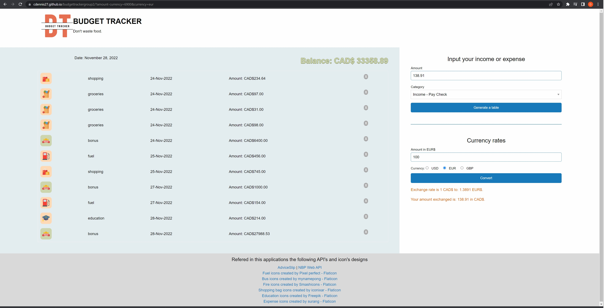

# Budget tracker for budget control! 

## Description

Simple code for a Budget tracker using interactive API's based on guidelines described on Challenge 7 Team Project of University of Toronto Bootcamp.

Used BNP Currency Exchange API, AdviceSlip API to give you the best "Tip of the Day" and DayJS to update date and time in the application.

Utized a Foundation CSS framework to optimze time during application styling.

Stored on client-side storage budget information for quick re-load and updates, with easy to use remove buttons, if anything added in error or to be discarded by the user.

## Future Improvements

Plans to insert ChartJS API to provide budget information in a graphic user interface for better user experience.

Addition of more currencies to our Currency Exchange tool.

## Table of Contents 

N/A

## Installation

N/A

## Link to proposal: https://github.com/cdennis27/budgettrackergroup2/blob/main/budgettrackerprop.pdf

## Usage

Good application for budget control and to help control expenses. A Currency Exchange Rate assist tool to help when needed to calculate present and future income or expense in different currencies.
Nice "Tip of the Day" to bring you something different while working on your finances.

## Screenshots

## Link to Application

https://cdennis27.github.io/budgettrackergroup2/?amount=9.99&category=payCheck

## Link to the GitHub repository

https://github.com/cdennis27/budgettrackergroup2

### Credits

Thanks to this Bootcamp contributors! I really appreciate the help and instruction!
Also lots of research on MDN website, youtube videos and StackOverflow was done to understand concepts used in this prototype. 

### License

MIT License

Copyright (c) 2022 cdennis27

Permission is hereby granted, free of charge, to any person obtaining a copy
of this software and associated documentation files (the "Software"), to deal
in the Software without restriction, including without limitation the rights
to use, copy, modify, merge, publish, distribute, sublicense, and/or sell
copies of the Software, and to permit persons to whom the Software is
furnished to do so, subject to the following conditions:

The above copyright notice and this permission notice shall be included in all
copies or substantial portions of the Software.

THE SOFTWARE IS PROVIDED "AS IS", WITHOUT WARRANTY OF ANY KIND, EXPRESS OR
IMPLIED, INCLUDING BUT NOT LIMITED TO THE WARRANTIES OF MERCHANTABILITY,
FITNESS FOR A PARTICULAR PURPOSE AND NONINFRINGEMENT. IN NO EVENT SHALL THE
AUTHORS OR COPYRIGHT HOLDERS BE LIABLE FOR ANY CLAIM, DAMAGES OR OTHER
LIABILITY, WHETHER IN AN ACTION OF CONTRACT, TORT OR OTHERWISE, ARISING FROM,
OUT OF OR IN CONNECTION WITH THE SOFTWARE OR THE USE OR OTHER DEALINGS IN THE
SOFTWARE.

---END